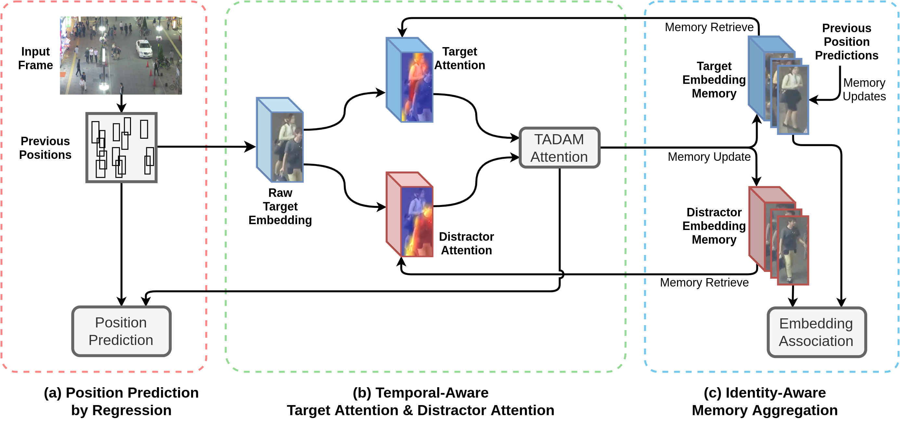

# Online Multiple Object Tracking with Cross-Task Synergy
This repository is the implementation of the CVPR 2021 paper ["Online Multiple Object Tracking with Cross-Task Synergy"](https://arxiv.org/abs/2104.00380)


## Installation
Tested on python=3.8 with torch=1.8.1 and torchvision=0.9.1.

It should also be compatible with python>=3.6, torch>=1.4.0 and torchvision>=0.4.0.
Not tested on lower versions.

### 1. Clone the repository
```
git clone https://github.com/songguocode/TADAM.git
```

### 2. Create conda env and activate
```
conda create -n TADAM python=3.8
conda activate TADAM
```

### 3. Install required packages
```
pip install torch torchvision scipy opencv-python yacs
```
All models are set to run on GPU, thus make sure graphics card driver is properly installed, as well as CUDA.

To check if `torch` is running with CUDA, run in python:
```
import torch
torch.cuda.is_available()
```
It is working if `True` is returned.

See [PyTorch Official Site](https://pytorch.org/get-started/locally/) if `torch` is not installed or working properly.

### 4. Clone MOTChallenge benchmark evaluation code
```
git clone https://github.com/JonathonLuiten/TrackEval.git
```

By now there should be two folders, `TADAM` and `TrackEval`.

Refer to [MOTChallenge-Official](https://github.com/JonathonLuiten/TrackEval/blob/master/docs/MOTChallenge-Official/Readme.md) for instructions.

Download the provided `data.zip`, unzip as folder `data` and copy inside `TrackEval` as `TrackEva/data`.

Move into  `TADAM` folder
```
cd TADAM
```

### 5. Prepare MOTChallenge data
Download [MOT16](https://motchallenge.net/data/MOT16.zip), [MOT17](https://motchallenge.net/data/MOT17.zip), [MOT17Det](https://motchallenge.net/data/MOT17Det.zip), and [MOT20](https://motchallenge.net/data/MOT20.zip) and place them inside a `datasets` folder.

Two options to provide `datasets` location for training/testing:
* a. Add a symbolic link inside `TADAM` folder by `ln -s path_of_datasets datasets`
* b. In `TADAM/configs/config.py`, assign `__C.PATHS.DATASET_ROOT` with `path_of_datasets`

### 6. Download Models
The training base of TADAM is a detector pretrained on COCO. The base model `coco_checkpoint.pth` is provided in [Google Drive](https://drive.google.com/drive/folders/13vVgYkq6lulxYmhW2FQucptbDDzij92i?usp=sharing)

Trained models are also provided for reference:
* TADAM_MOT16.pth
* TADAM_MOT17.pth
* TADAM_MOT20.pth

Create a folder `output/models` and place all models inside.

## Train
1. Training on single GPU, for MOT17 as an example
```
python -m lib.training.train TADAM_MOT17 --config TADAM_MOT17
```
First `TADAM_MOT17` specifies the output name of the trained model, which can be changed as preferred.

Second `TADAM_MOT17` refers to the config file `lib/configs/TADAM_MOT17.yaml` that loads training parameters. Switch config for respective dataset training. Config files are located in `lib/configs`.

2. Training on multiple GPU with [Distributed Data Parallel](https://pytorch.org/docs/stable/notes/ddp.html)
```
OMP_NUM_THREADS=1 python -m torch.distributed.launch --nproc_per_node=2 --use_env -m lib.training.train TADAM_MOT17 --config TADAM_MOT17
```
Argument `--nproc_per_node=2` specifies how many GPUs to be used for training. Here 2 cards are used.

Trained model will be stored inside `output/models` with the specified output name

## Evaluate
```
python -m lib.tracking.test_tracker --result-name xxx --config TADAM_MOT17 --evaluation
```
Change `xxx` to prefered result name.
`--evaluation` toggles on evaluation right after obtaining tracking results. Remove it if only running for results without evaluation. Evaluation requires all sequences results of the specified dataset.

Either run evaluation after training, or download and test the provided trained models.

Note that if output name of the trained model is changed, it must be specified in corresponding `.yaml` config file's line, i.e. replace value in `MODEL: TADAM_MOT17.pth` with expected model file name.

Add `--which_set test` flag to run on test dataset. Note that `--evaluation` should be removed, as no evaluation result is available for test dataset.

Code from `TrackEval` is used for evaluation, and it is set to run on multiple cores (8 cores) by default.

To run an evaluation after obtaining tracking results (with sequences result files), run:
```
python -m lib.utils.official_benchmark --result-name xxx --config TADAM_MOT17
```
Replace `xxx` with the result name, and choose config accordingly.

Tracking results can be found in `output/results` under respective dataset name folders.
Detailed result is stored in a `xxx_detailed.csv` file, while the summary is given in a `xxx_summary.txt` file.

### Results for reference
The evaluation results on train sets are given here for reference. See paper for reported test sets results.
* MOT16
```
MOTA	MOTP	MODA	CLR_Re	CLR_Pr	MTR	PTR	MLR	CLR_TP	CLR_FN
63.7	91.6	63.9	64.5	99.0	35.6	40.8	23.6	71242	39165
CLR_FP	IDSW	MT	PT	ML	Frag	sMOTA	IDF1	IDR	IDP
689	186	184	211	122	316	58.3	68.0	56.2	86.2
IDTP	IDFN	IDFP	Dets	GT_Dets	IDs	GT_IDs
62013	48394	9918	71931	110407	446	517
```
* MOT17
```
MOTA	MOTP	MODA	CLR_Re	CLR_Pr	MTR	PTR	MLR	CLR_TP	CLR_FN
68.0	91.3	68.2	69.0	98.8	43.5	37.5	19.0	232600	104291
CLR_FP	IDSW	MT	PT	ML	Frag	sMOTA	IDF1	IDR	IDP
2845	742	712	615	311	1182	62.0	71.6	60.8	87.0
IDTP	IDFN	IDFP	Dets	GT_Dets	IDs	GT_IDs
204819	132072	30626	235445	336891	1455	1638
```
* MOT20
```
MOTA	MOTP	MODA	CLR_Re	CLR_Pr	MTR	PTR	MLR	CLR_TP	CLR_FN
80.2	87.0	80.4	82.2	97.9	64.0	28.8	7.18	932899	201715
CLR_FP	IDSW	MT	PT	ML	Frag	sMOTA	IDF1	IDR	IDP
20355	2275	1418	638	159	2737	69.5	72.3	66.5	79.2
IDTP	IDFN	IDFP	Dets	GT_Dets	IDs	GT_IDs
754621	379993	198633	953254	1134614	2953	2215
```
Results could differ slightly, and small variations should be acceptable.

## Visualization
A visualization tool is provided to preview datasets' ground-truths, provided detections, and generated tracking results.
```
python -m lib.utils.visualization --config TADAM_MOT17 --which-set train --sequence 02 --public-detection FRCNN --result xxx --start-frame 1 --scale 0.8
```
Specify config files, train/test split, and sequence with `--config`, `--which-set`, `--sequence` respectively. `--public-detection` should only be specified for MOT17.

Replace `--result xxx` with the tracking results
`--start-frame 1` means viewing from frame 1, while `--scale 0.8` resizes viewing window with given ratio.

Commands in visualization window:
* "<": previous frame
* ">": next frame
* "t": toggle between viewing ground_truths, provided detections, and tracking results
* "s": save current frame with all rendered elements
* "h": hide frame information on window's top-left corner
* "i": hide identity index on bounding boxes' top-left corner
* "Esc" or "q": exit program

## Pretrain detector on COCO
Basic detector is pretrained on COCO dataset, before training on MOT. A Faster-RCNN FPN with ResNet101 backbone is adopted in this code, which can be replaced by other similar detectors with code modifications.

Refer to [Object detection reference training scripts](https://github.com/pytorch/vision/tree/master/references/detection) on how to train a PyTorch-based detector.

See [Tracking without bells and whistles](https://github.com/phil-bergmann/tracking_wo_bnw) for a jupyter notebook hands-on, which is also based on the aforementioned reference codes.

## Publication
If you use the code in your research, please cite:
```
@InProceedings{TADAM_2021_CVPR,
    author = {Guo, Song and Wang, Jingya and Wang, Xinchao and Tao, Dacheng},
    title = {Online Multiple Object Tracking With Cross-Task Synergy},
    booktitle = {Proceedings of the IEEE/CVF Conference on Computer Vision and Pattern Recognition (CVPR)},
    month = {June},
    year = {2021},
}
```
